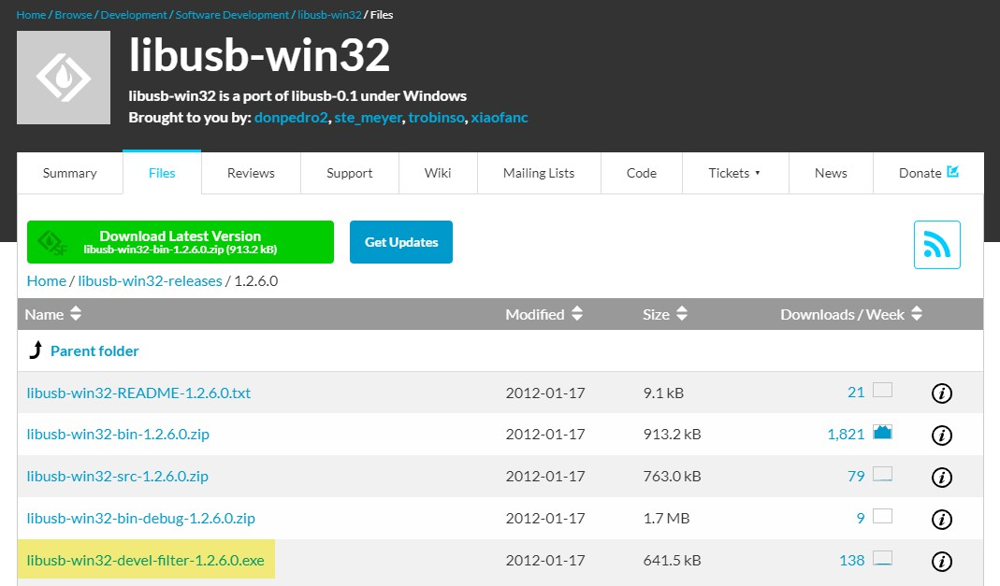
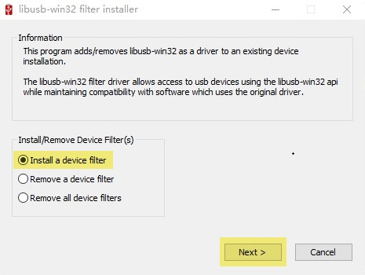
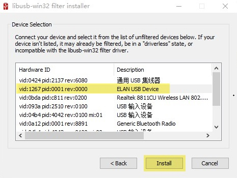
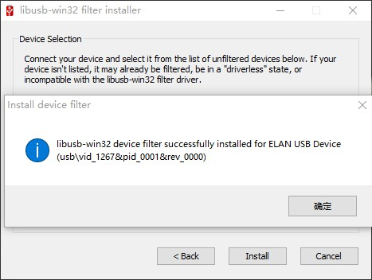

# Installation Instructions for libusb on Windows

`PyUSB` requires a manually installed `libusb` as its backend. Unluckily, `libusb` on Windows platform is not so convenient as it looks like. This draft notes my experience on how to correctly link `libusb` with our project.

## 1. Install libusb-win32 on SourceForge

Directly download the `.exe` file on [this page](https://sourceforge.net/projects/libusb-win32/files/libusb-win32-releases/1.2.6.0/) and install it.

<p align="center">
	
</p>

## 2. Install the device filter for OWI-535 driver

Open the installed filter installer, and install a device filter for the corresponding device.

<p align="center">
	
</p>

<p align="center">
	
</p>

<p align="center">
	
</p>

Done. Now we can communicate with our OWI-535 with the help of `libusb-win32` on Windows.

## About libusb v1.0

I've tried the official distribution of [libusb](https://libusb.info/), too. However, it will raise a system error like the following format when sending messages to the robot arm:

```
OSError: exception: access violation writing 0x0000000000000024
```

It may results from inner conflicts of `libusb`. So distributions of `libusb` other than `libusb-win32` on Windows is not recommended.

## References

[PyUSB's instructions](https://github.com/pyusb/pyusb#installing)

[libusb's instructions](https://github.com/libusb/libusb/wiki/Windows#driver-installation)