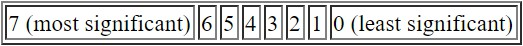

# Message Rules

> The device is controlled by 3 byte commands sent via USB control transfers. Command format is byte0, byte1, byte2. Each byte controls a group of arm features. All motors could be controlled independently. Most commands start action which is continued until next action is signalled. Byte '00' universally used as stop action.

## Byte0

The first byte (`Byte0`) controls **Gripper**, **Shoulder**, **Elbow** and **Wrist**.

The bits of `Byte0` are assigned as follows:

| Bit Positions |  Joints  |                  Rules                   |
| :-----------: | :------: | :--------------------------------------: |
|     1, 0      | Gripper  |    00-do not move, 01-close, 10-open     |
|     3, 2      |  Wrist   | 00-do not move, 01-move up, 10-move down |
|     5, 4      |  Elbow   | 00-do not move, 01-move up, 10-move down |
|     7, 6      | Shoulder | 00-do not move, 01-move up, 10-move down |

Note there is no '11' in the rule for any joint.

The combination of bits with different values in `Byte0` achieves simultaneous controlling of the four joints.

## Byte1

The second byte (`Byte1`) controls **Base**.

The bits of `Byte1` are assigned as follows:

| Bit Positions | Joints |                            Rules                             |
| :-----------: | :----: | :----------------------------------------------------------: |
|     1, 0      |  Base  | 00-do not move, 01-rotate clockwise, 10-rotate anticlockwise |

Higher positioned bits are ignored.

## Byte2

The third byte (`Byte2`) controls **LED light** inside the gripper.

The bits of `Byte2` are assigned as follows:

| Bit Positions | Joints |    Rules    |
| :-----------: | :----: | :---------: |
|       0       | Light  | 0-off, 1-on |

## Appendix - Bit Numbering In Byte

In a byte there are eight bits, which are usually indexed as follows:

    

## References

- [zimchaa/roboarm](https://github.com/zimchaa/roboarm)
- [Vadim Zaliva's blog](https://notbrainsurgery.livejournal.com/38622.html)